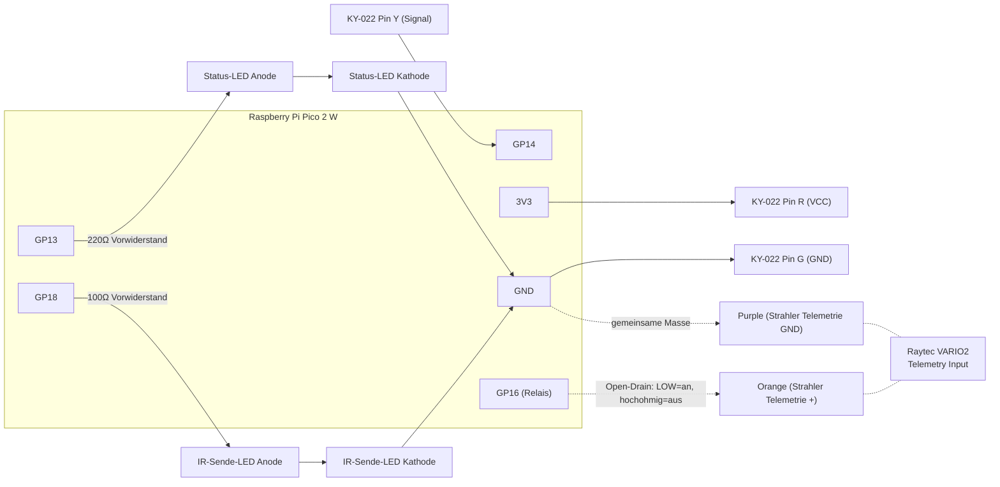

# Pico_IR_Strahler

MicroPython-Projekt fuer Raspberry Pi Pico 2 W: lernt die IR-Codes einer
Raytec-VARIO2-Fernbedienung ein, spielt sie ueber eine IR-Sende-LED wieder
ab, steuert den Raytec-Telemetrie-Eingang per Relais/GPIO im An/Aus-Puls
und stellt das Ganze ueber eine WLAN-Weboberflaeche bereit.

## Zugriff (aktueller Stand)

Der Pico haengt aktuell im WLAN des ZTE-Mobile-Hotspots (`ZTE_6F9977`),
Dashboard erreichbar unter **http://192.168.8.32**. Die Zugangsdaten
liegen ausschliesslich in `/wifi_config.json` auf dem Pico-Flash (nicht
im Repo, siehe unten) — bei einem Netzwerkwechsel dort SSID/Passwort
aendern und den Pico neu starten. IP kann sich bei einer neuen DHCP-
Vergabe aendern; ein Blick ins Admin-Interface des Hotspots
(Geraeteliste) zeigt die aktuelle IP, falls sie einmal abweicht.

## Hardware-Uebersicht

| Funktion | GPIO | Bauteil / Wert |
|---|---|---|
| IR-Empfaenger Signal | GP14 | KY-022-Modul (VS1838B/TL1838), Pin "Y" — kein Widerstand noetig |
| IR-Empfaenger Stromversorgung | 3V3 | KY-022-Modul, Pin "R" |
| IR-Empfaenger Masse | GND | KY-022-Modul, Pin "G" |
| IR-Sende-LED Signal | GP18 | IR-LED (Anode) ueber Vorwiderstand |
| IR-Sende-LED Vorwiderstand | GP18 → LED | **100 Ω** (Bereich 100–220 Ω; kleiner = mehr Strom/Reichweite, aber GPIO-Strombegrenzung beachten) |
| IR-Sende-LED Kathode | → GND | direkt |
| Status-LED (Lern-/Sende-Anzeige) | GP13 | LED + Vorwiderstand ~220 Ω → GND |
| Strahler-Telemetrie-Relais (Open-Drain) | **GP16** | Orange direkt an GP16, kein Widerstand (Open-Drain-Software) |

**Hinweis:** GP12 wurde zuerst verwendet, liess sich aber nicht sauber auf
LOW ziehen (moeglicher Pin-Defekt) → Wechsel auf GP17. Am 2026-09-15 zeigte
sich derselbe Fehlertyp erneut, diesmal auf **GP17**: der Pin haengt fest auf
LOW, selbst voellig unbeschaltet und mit aktiviertem internen Pull-Up (der
ihn eigentlich auf HIGH ziehen sollte). Diagnose per `mpremote exec` direkt
auf dem Pico (`Pin(17, Pin.IN, Pin.PULL_UP).value()`). Mehrere andere GPIOs
(16, 19, 20, 21, 22, 26, 27, 28) wurden mit demselben Verfahren als
elektrisch gesund bestaetigt (lesen HIGH bei offenem Pin). Umgestellt auf
**GP16** (direkter Nachbar-Pin von GP17 auf der Platine) — **funktioniert
zuverlaessig** und ist die aktuelle, getestete Konfiguration.

**Wichtig — vor dem ersten Pulsen einmalig "TEL" senden:** Die Taste `tel`
("Selects Telemetry Input") muss einmal gesendet werden, damit der
Telemetrie-Eingang tatsaechlich die Beleuchtung steuert. Ohne das hat das
Relais/GPIO keine sichtbare Wirkung, obwohl die Spannung am Eingang korrekt
schaltet. Reihenfolge: `photocell_off` (Photocell deaktivieren) → `tel`
(Telemetrie-Eingang auswaehlen) → danach schaltet `IRStrahler(16)`
zuverlaessig die Beleuchtung.

## Schaltplan



### IR-Empfaenger: KY-022-Modul (VS1838B/TL1838)

Urspruenglich wurde mit einer blanken Fotodiode + 10kΩ-Pull-Down
experimentiert — das lieferte kein sauber demoduliertes Signal (kein
AGC, keine 38kHz-Filterung, reagierte auf jedes Umgebungslicht) und
fuehrte bei einer Taste (`power_5`) zu einer durchgehend verrauschten,
unbrauchbaren Aufzeichnung. **Seit dem Umstieg auf das KY-022-Modul
(VS1838B-Chip) ist dieses Problem behoben** — alle 19 Tasten liessen sich
danach sauber und konsistent einlernen.

Pin-Beschriftung auf dem KY-022 (kann je nach Charge variieren, im
Zweifel Aufdruck pruefen): **G**=GND, **R**=VCC (3.3V), **Y**=Signal
(direkt an GPIO, kein Vorwiderstand noetig).

**Hinweis:** Das Modul ist deutlich empfindlicher als eine blanke
Fotodiode — bei zu geringem Abstand (wenige cm) kann es zu Fehlmessungen
kommen (AGC-Uebersteuerung). Ca. **20–30 cm Abstand** zur Fernbedienung
funktioniert zuverlaessig.

### GPIO-Identifikation — Lessons Learned

Im Laufe des Projekts gab es mehrfach Verwechslungen zwischen physischen
Pico-Pins (z.B. GP12 vs. GP16, GP14 vs. GP18). Zuverlaessige Methode zur
Verifikation eines unbekannten Kabels:

```python
from machine import Pin
candidates = list(range(0,23)) + [26,27,28]
low_pins = []
for n in candidates:
    try:
        p = Pin(n, Pin.IN, Pin.PULL_UP)
        if p.value() == 0:
            low_pins.append(n)
    except Exception:
        pass
print(low_pins)
```
Das zu identifizierende Kabel kurz an einen bekannten GND-Pin halten —
der GPIO, der dabei in `low_pins` auftaucht, ist der gesuchte Pin.

**Achtung:** Nach mehreren Scans mit `Pin.PULL_UP` kann eine alte
Pull-Konfiguration an einem Pin "haengen bleiben" und nachfolgende
`Pin.IN`-Messungen verfaelschen. Nach intensivem Scannen einmal
`mpremote ... reset` durchfuehren, bevor man sich auf eine Spannungsmessung
verlaesst.

## Relais-Verkabelung am Raytec-Strahler (VARIO2 Standard IR)

Laut Raytec "Combined Installation Guide" (0330-D-00018-Rev4), Step 4:

- **Orange & Purple Wires = Telemetry Input**, Volt-Free/Dry-Contact oder TTL
- Werksdefault: Telemetry Input geschlossen/gebrueckt (Photocell steuert
  automatisch Tag/Nacht)
- **Volt-Free-Modus: Kurzschluss (Orange↔Purple) = Licht an**
- Damit die Telemetrie den Strahler ueberhaupt direkt steuert, muessen
  **zwei** Tasten einmalig gesendet werden (per echter Fernbedienung oder
  per `send_by_name`):
  1. **`photocell_off`** (Photocell Disable, durchgestrichenes Mond-Symbol,
     PHOTOCELL-Spalte 4. Reihe) — sonst hat das Photocell Vorrang
  2. **`tel`** (Selects Telemetry Input) — ohne diesen Schritt schaltet
     die Spannung am Eingang zwar korrekt (mit Multimeter messbar), der
     Strahler reagiert aber trotzdem nicht sichtbar
  Bestaetigung fuer Schritt 1: rechte Status-LED am Strahler leuchtet kurz
  **durchgehend Amber** bei gueltigem Fernbedienungs-Befehl.
- Verkabelung: **Purple → Pico GND**, **Orange → GP16**
- Ansteuerung im Code ist **Open-Drain** (siehe `ir_strahler.py`):
  "An" = Pin als Ausgang auf LOW (simuliert Kurzschluss), "Aus" = Pin als
  hochohmiger Eingang (keine aktive Spannung auf die Leitung). Dadurch
  sicher fuer Eingaenge, bei denen die tatsaechliche interne
  Referenzspannung unbekannt ist.
- Getestet mit Pico-Stromversorgung ueber USB (separates Netzteil zum
  Strahler); gemeinsames GND ueber die Purple-Leitung war ausreichend.

## Status-LEDs am Raytec-Strahler (zur Fehlersuche)

Zwei mehrfarbige LEDs an der Unterseite des Geraets:

- **LHS (links) durchgehend GRUEN** = Spannung liegt an, kein Fehler
- **LHS blinkend GRUEN** = Fernbedienungs-Empfangsproblem
- **LHS ROT** = Geraetefehler
- **RHS (rechts) blinkend AMBER** = Programming Mode aktiv (hier
  funktionieren alle Fernbedienungsbefehle; nach 7 Tagen oder 30 Min.
  nach letztem manuellem Tastendruck am Geraet selbst wechselt das Geraet
  in Operating Mode, dort funktionieren nur noch wenige Befehle)
- **RHS durchgehend AMBER (kurz)** = gueltiger Fernbedienungsbefehl wurde
  empfangen (nur im Programming Mode) — sehr nuetzlich, um zu pruefen, ob
  ein gesendeter IR-Code überhaupt als gueltig erkannt wird

**Wichtig:** Der Strahler emittiert **Infrarotlicht**, das mit blossem
Auge nicht sichtbar ist! Reaktion immer per Handykamera pruefen (zeigt
IR als hellen Punkt) oder ueber die Status-LEDs, niemals nur mit bloßem
Auge.

## Bekannter Software-Bug (behoben)

MicroPythons `str.format()` kommt mit sehr vielen `{}`-Zeichen in einem
langen String (z.B. eingebettetes CSS) nicht zuverlaessig klar und bricht
den String u.U. still auf wenige hundert Zeichen ab, ohne Fehler zu
werfen. Loesung: grosse HTML/CSS/JS-Strings als reine Literale schreiben
und dynamische Teile per `.replace()` mit eindeutigen Platzhalter-Tokens
(z.B. `___GRID___`) einsetzen, nicht per `.format()`.

Ebenso: `socket.send()` sendet bei groesseren Antworten (>~6KB) nicht
zwingend alle Bytes in einem Aufruf. Im Webserver wird deshalb in einer
Schleife gesendet, bis alle Bytes tatsaechlich uebertragen wurden (siehe
`run_server()` in `web_server.py`).

## Dateien

- `main.py` — auf dem Pico: identisch mit `web_server.py`, wird von
  MicroPython automatisch beim Boot ausgefuehrt (startet WLAN + Webserver)
- `web_server.py` — WLAN-Weboberflaeche: Fernbedienungs-Nachbildung (alle
  gelernten Tasten), Strahler-Puls-Steuerung, Standort/Notizen-Felder,
  Live-Empfangs-Anzeige beim Senden
- `wifi_config.json` — WLAN-Zugangsdaten (`{"ssid": "...", "password": "..."}`),
  getrennt vom Code, damit sie direkt auf dem Geraet (z.B. mit Thonny)
  geaendert werden koennen, ohne den Code anzufassen. **Auf GitHub steht
  nur ein Platzhalter** — die echte Datei existiert nur auf dem Pico-Flash.
- `ir_learn.py` — nimmt IR-Signale roh auf (Interrupt-basiert, GP14/15)
  und speichert sie unter einem Namen; blinkt Status-LED (GP13) waehrend
  des Wartens, leuchtet dauerhaft bei Erfolg
- `ir_send.py` — spielt einen gespeicherten Code ueber die Sende-LED
  (GP18) ab, 38kHz-Traegerfrequenz, ~69% Tastgrad
- `ir_codes.py` — Speichern/Laden der gelernten Codes als JSON
  (`/codes.json` auf dem Pico-Flash)
- `ir_strahler.py` — konfigurierbare Open-Drain An/Aus-Pulssteuerung per
  Hardware-Timer (keine Blockierung)
- `ir_raw_capture.py` — einfaches Debug-Skript zum Anzeigen roher
  Impulszeiten ohne Speichern
- `codes.json` — Sicherung der bereits eingelernten Tasten der
  Raytec-Fernbedienung
- `mdns_responder.py` — minimaler mDNS-Responder (`raytec.local`), laeuft
  per `_thread` auf dem zweiten Core parallel zum Webserver. Funktioniert
  technisch korrekt (Multicast-Gruppenbeitritt per `IP_ADD_MEMBERSHIP`),
  Aufloesung im Netz haengt aber vom Router ab (siehe "Bekannte offene
  Punkte")

## Deployment auf einen (neuen) Pico

1. Alle `.py`-Dateien sowie `codes.json` per `mpremote fs cp` auf den
   Pico kopieren
2. `web_server.py` zusaetzlich als `main.py` kopieren (Autostart)
3. `wifi_config.json` mit **echten** Zugangsdaten anlegen (Platzhalter
   aus dem Repo ueberschreiben)
4. Bei abweichender Verkabelung: GPIO-Konstanten in `ir_learn.py`
   (`RX_PIN`, `RX_PWR_PIN`, `STATUS_LED_PIN`), `ir_send.py` (`TX_PIN`)
   und `web_server.py` (`STRAHLER_PIN`) anpassen — siehe Tabelle oben
5. `mpremote ... reset` — Pico bootet automatisch, verbindet WLAN,
   startet Webserver auf Port 80

## Weboberflaeche

Die Startseite bildet die Original-Fernbedienung nach (alle 19 Tasten als
runde Buttons, Icons per SVG, kein Emoji) und enthaelt zusaetzlich eine
zweite, kleinere "BERNARD TEC"-Fernbedienung fuer die Strahler-Relais-
Steuerung (GP16), im selben visuellen Stil.

Features:
- **Hover-Tooltips** (3 Sek. Verzoegerung) mit den passenden Handbuch-
  Erklaerungen zu jeder Taste, auch fuer die Strahler-Steuerungstasten
- **Hold-to-Confirm** fuer `reset` und `lock`: Taste 4 Sekunden gedrueckt
  halten (Countdown-Zahl direkt im Button, roter Rahmen), erst bei 0 wird
  gesendet — verhindert versehentliches Ausloesen
- **"Zuletzt gesendet"-Anzeige**: gruener Rahmen an der zuletzt gesendeten
  Taste, Label unter der Hauptfernbedienung
- **Strahler-Fernbedienung** (BERNARD TEC): `Start`/`Stop` fuer den
  Puls-Timer, `An`/`Aus` fuer Dauerbetrieb ohne Timer. Start/An senden
  automatisch einmalig `photocell_off` + `tel`, damit der Telemetrie-
  Eingang die Beleuchtung ueberhaupt steuert (siehe Relais-Verkabelung
  oben) — das passiert nur beim UEbergang von gestoppt zu laufend, nicht
  bei jeder Timing-Aenderung
- **Live-Timing-Update**: Wird bei laufendem Puls `An (ms)` oder
  `Aus (ms)` geaendert, zeigt der `Start`-Button einen 10-Sekunden-
  Countdown (Zahl im Button, blinkender gruener Rahmen) und uebernimmt die
  neuen Werte danach automatisch, ohne die Vorbereitungs-Befehle erneut zu
  senden
- **Projektnummer/Standort/Notizen-Felder** (oberhalb der Fernbedienung),
  persistent in `/config.json` gespeichert
- **Automatische Zustandswiederherstellung nach Stromausfall** (Pico und/
  oder Strahler): Power-Select-Stufe und Puls-/Dauerbetrieb-Zustand werden
  bei jeder Aenderung in `/strahler_state.json` gespeichert. Beim Booten
  (`restore_state()` in `web_server.py`) wird automatisch die zuletzt
  gewaehlte Stufe erneut gesendet und, falls zuletzt gepulst/dauerhaft an
  war, die komplette Vorbereitung (`photocell_off`/`tel`/`timer_off`) plus
  der letzte Puls-/An-Zustand wiederhergestellt — ohne manuellen Eingriff.
  Vor dem ersten Senden wartet der Pico fest 10 Sekunden (`STRAHLER_BOOT_
  WAIT_MS`), falls der Strahler selbst gerade erst wieder Strom bekommen
  hat und sein IR-Empfaenger noch hochfaehrt (keine Angabe dazu im
  Handbuch gefunden, Sicherheitswert)
- **WLAN-Signal-Icon** (4 Balken, gruen/rot) oben auf der Seite, alle 8s
  per `/api/wifi` aktualisiert — praktisch zur Fehlersuche bei
  Verbindungsproblemen
- **Event-Log** (ganz unten, eingeklappt per `<details>`, nicht automatisch
  sichtbar): protokolliert Boot, Start/Stop, An/Aus und automatische
  Wiederherstellung mit echter UTC-Zeit (NTP-Sync beim Booten), nach Datum
  gruppiert, auf 300 Eintraege begrenzt (kuerzt sich selbst, sobald die
  Datei deutlich groesser wird — schont den Flash-Speicher), mit manuellem
  Aktualisieren-Button und einem bestaetigungsgeschuetzten "Log loeschen"-
  Button

## Betriebssicherheit / Ausfallsicherheit

Der Pico laeuft im Feldeinsatz unbeaufsichtigt (z.B. an einem Mobile-
Hotspot, der auch mal ausfaellt oder neu startet). Dafuer eingebaut:

- **WLAN-Boot gibt nie auf**: `main()` versucht `connect_wifi()` in einer
  Endlosschleife (3s Pause zwischen Versuchen), `connect_wifi()` selbst
  macht bis zu 6 komplette Verbindungsversuche pro Aufruf. Ein einzelner
  fehlgeschlagener Boot-Versuch fuehrt also nie zu einem dauerhaft
  gestoppten Geraet.
- **Watchdog waehrend des Betriebs**: `run_server()` prueft bei 20s
  Inaktivitaet die echte Erreichbarkeit des Gateways (nicht nur
  `wlan.isconnected()`, das bei manchen Access Points faelschlich
  "verbunden" bleibt) und erzwingt bei Bedarf einen Reconnect.
- **Eingebaute LED als Status-Anzeige** (Pico W/2 W, `Pin("LED")`), auch
  ohne USB-Zugriff ablesbar:
  - **langsames Blinken** — verbindet gerade mit dem WLAN
  - **durchgehend an** — verbunden
  - **kurzes schnelles Blinken** — alle 6 Versuche fehlgeschlagen, bevor
    der Boot-Prozess von vorne beginnt
- **Zustandswiederherstellung** nach Stromausfall (siehe oben,
  `/strahler_state.json`) und **Event-Log** zur nachtraeglichen Analyse,
  wie oft/wann das vorkommt.
- **NTP-Zeitsync** (`ntptime.settime()`) beim Booten, direkt nach der
  WLAN-Verbindung — ohne das wuerde die interne Uhr bei jedem
  Stromausfall zurueckspringen und Log-Zeitstempel waeren wertlos.

## Web-API (fuer eigene Skripte/Integrationen)

- `GET /` — HTML-Oberflaeche
- `GET /api/buttons` — Liste aller gelernten Tastennamen
- `POST /api/send/<name>` — Code senden (inkl. gleichzeitiger
  Empfangs-Aufzeichnung zur Loopback-Pruefung, LED-Blitz auf GP13)
- `GET /api/last` — zuletzt gesendete Taste + Zeitstempel
- `GET /api/last_rx` — beim letzten Senden empfangene Rohdaten (Loopback)
- `POST /api/strahler/start?on_ms=100&off_ms=50` — Puls starten (sendet
  beim allerersten Start automatisch `photocell_off` + `tel`)
- `POST /api/strahler/stop` — Puls stoppen (Relais-Kontakt offen)
- `POST /api/strahler/on` — Dauerhaft An, kein Puls-Timer (sendet beim
  Uebergang von gestoppt automatisch `photocell_off` + `tel`)
- `POST /api/strahler/off` — Dauerhaft Aus, kein Puls-Timer
- `GET /api/strahler/status` — `{running, pin, on_ms, off_ms}` —
  `running` ist `true` (pulsiert), `"on"` (dauerhaft an) oder `false`
- `GET/POST /api/config` — Projektnummer/Standort/Notizen
  (`{"projektnummer": "...", "standort": "...", "notizen": "..."}`)
- `GET /api/wifi` — aktuelle WLAN-Signalstaerke `{"rssi": -47}` (dBm, via
  `wlan.status("rssi")`)
- `GET /api/log` — Event-Log, neueste zuerst, je Eintrag `{ts, event,
  date, time, ...}` (z.B. `on_ms`/`off_ms` bei `start`); Events: `boot`,
  `start`, `stop`, `on`, `off`, `restore`
- `DELETE /api/log` — loescht das komplette Event-Log

## Verwendung (direkt per REPL)

```python
from ir_learn import learn
learn('power_5')          # Taste kurz antippen, waehrend die Status-LED blinkt

from ir_send import send_by_name
send_by_name('power_5')   # gespeicherten Code abspielen

from ir_strahler import IRStrahler
s = IRStrahler(17)
s.start(on_ms=100, off_ms=50)
s.stop()
```

## Bekannte offene Punkte

- ~~`power_5` unregelmaessiges Signal~~ — **geloest**: kurze, feste
  Tastendruecke (statt Halten) liefern durchgehend saubere, konsistente
  Aufzeichnungen. Alle 19 Codes wurden mit dieser Technik final neu
  eingelernt.
- ~~`reset`/`lock` — 4-Sekunden-Halteregel laut Handbuch, aber nicht in
  der Aufzeichnung sichtbar~~ — **geloest**: Die Original-Fernbedienung
  sendet bei gehaltener Taste wiederholt kurze Signal-Bursts (die 3
  Status-LEDs am Strahler bleiben deshalb die ganze Zeit orange). Die
  Aufzeichnung enthielt nur einen einzelnen ~500ms-Burst. Die Web-Version
  spielt diesen Burst jetzt fuer `reset`/`lock` alle 40ms wiederholt fuer
  ~4,5 Sekunden ab (siehe `/api/send/<name>`-Handler) — live am echten
  Geraet als identisch zur Original-Fernbedienung bestaetigt. **Achtung:**
  ein echter Reset setzt weiterhin alle Strahler-Einstellungen zurueck.
- ~~Relais/GP12 unklares Verhalten~~ — **geloest**: Wechsel auf GP17
  behebt das Problem, und `tel` muss vor dem ersten Pulsen einmalig
  gesendet werden (siehe Relais-Verkabelung oben).
- ~~Relais/GP17 zeigte am 2026-09-15 keine Wirkung mehr am Strahler~~ —
  **geloest**: GP17 war hardwareseitig defekt (haengt fest auf LOW, auch
  unbeschaltet mit Pull-Up). Diagnostiziert per direkter Pin-Abfrage via
  `mpremote exec`; mehrere Alternativ-GPIOs auf Funktionsfaehigkeit
  getestet, auf **GP16** umgestellt. Live am echten Strahler bestaetigt
  funktionsfaehig (sichtbares Pulsen).
- ~~Fremd-Tasten (Power Select, Timer Setting, ...) unterbrechen laufendes
  Pulsen~~ — **geloest**: Fast jede Taste ausser `photocell_off`/`tel`/
  `timer_off` schaltet den Strahler intern von "Telemetrie steuert An/Aus"
  auf einen manuellen/anderen Modus um (er leuchtet dann nur noch
  durchgehend in der gewaehlten Stufe statt dem Relais zu folgen). Der
  `/api/send/<name>`-Handler sendet deshalb automatisch die komplette
  Telemetrie-Vorbereitung erneut, wenn eine Fremd-Taste gesendet wird,
  waehrend der Strahler pulst/an ist (kurzer ~2-3s Lichtwechsel, dann
  automatische Wiederherstellung).
- ~~WLAN-Verbindung zum ZTE-Mobile-Hotspot instabil (verbindet, dann
  sofort wieder weg)~~ — **geloest**: Ursache war der WLAN-
  Energiesparmodus des Pico (`cyw43439`), der den Funk periodisch schlafen
  legt und dabei Pakete von manchen Access Points verpasst — ein Laptop
  am selben Hotspot war davon nicht betroffen, was den entscheidenden
  Hinweis gab. Behoben mit `wlan.config(pm=0xa11140)` (Sparmodus aus).
  Zusaetzlich robuster gemacht: `connect_wifi()` versucht bis zu 6x pro
  Aufruf und der Boot-Prozess in `main()` gibt nie komplett auf (versucht
  nach einem Fehlschlag alle 3s erneut), ein Watchdog in `run_server()`
  prueft bei Inaktivitaet (20s) die echte Erreichbarkeit (nicht nur
  `wlan.isconnected()`, das faelschlich "verbunden" bleiben kann) und
  erzwingt bei Bedarf einen Reconnect, und jede Client-Verbindung hat
  einen 10s-Timeout, damit eine haengende Anfrage nicht den ganzen
  (einzelnen) Server-Thread blockiert.
- Andere Tasten (Photocell-Stufen, Timer-Stufen, Tel/Dim, Lock, Status,
  Reset) wurden eingelernt, aber noch nicht einzeln gegen den echten
  Strahler verifiziert. Die Timer-Namen (`timer_full/75/50/25/off`)
  basieren auf einer visuellen Vermutung anhand der Fuellstand-Grafik auf
  der Fernbedienung, nicht auf einer Bestaetigung durch das Handbuch
  (das spricht von konkreten Minutenwerten: 30/10/3/1 Min./deaktiviert).
- **mDNS (`raytec.local`) funktioniert noch nicht zuverlaessig**: Der
  Responder auf dem Pico laeuft korrekt (bestaetigt per direktem
  Multicast-Test), aber Anfragen kamen im Test nicht durch — vermutlich
  weil der aktuell genutzte Router/Hotspot Multicast-Verkehr zwischen
  WLAN-Clients nicht durchlaesst (Client-Isolation/fehlendes IGMP
  Snooping). Betrifft nicht die Kernfunktion, die feste IP funktioniert
  zuverlaessig.
